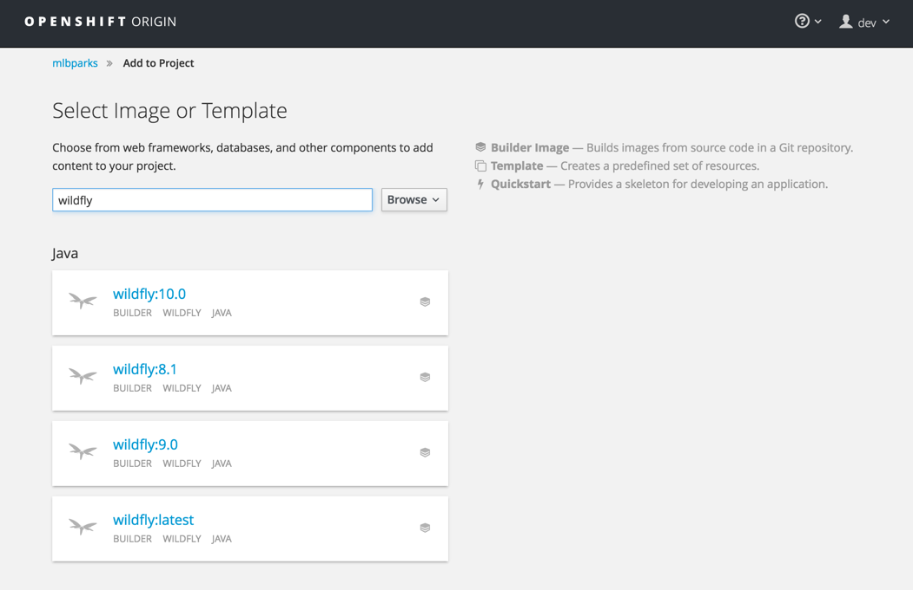
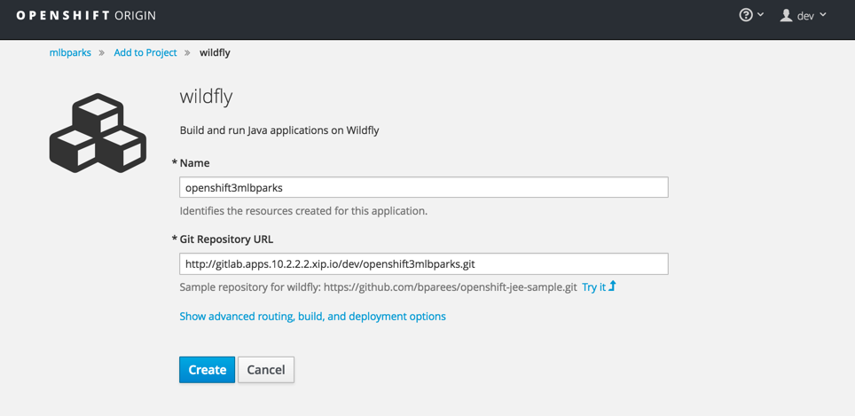
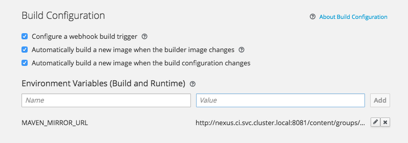
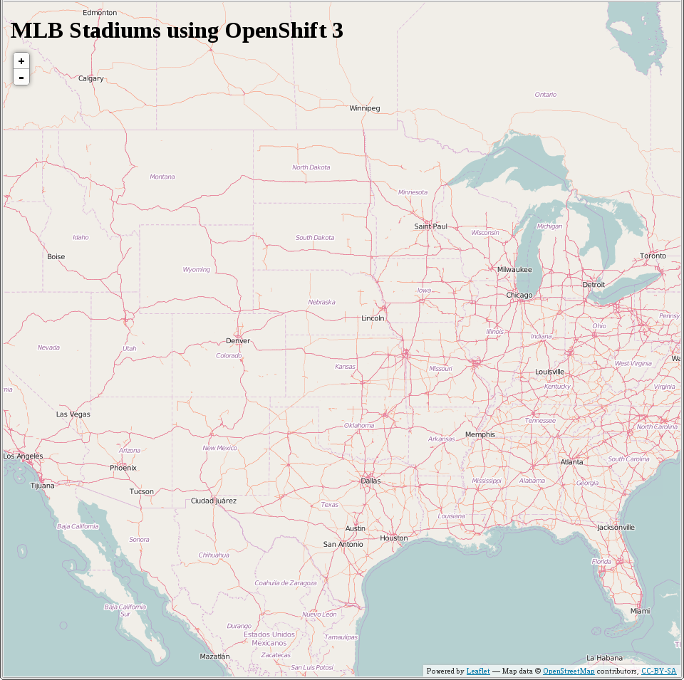

#** Lab 7: Deploying Java Code on JBoss**

###** Background: Source-to-Image (S2I) **

In lab three we learned how to deploy a pre-existing Docker image from a Docker
registry. Now we will expand on that a bit by learning how OpenShift builds a
Docker images using source code from an existing repository.

[Source-to-Image (S2I)](https://github.com/openshift/source-to-image) is another
open source project sponsored by Red Hat. Its goal:

    Source-to-image (S2I) is a tool for building reproducible Docker images. S2I
    produces ready-to-run images by injecting source code into a Docker image and
    assembling a new Docker image which incorporates the builder image and built
    source. The result is then ready to use with docker run. S2I supports
    incremental builds which re-use previously downloaded dependencies, previously
    built artifacts, etc.

OpenShift is S2I-enabled and can use S2I as one of its build mechanisms (in
addition to building Docker images from Dockerfiles, and "custom" builds).

OpenShift runs the S2I process inside a special *Pod*, called a Build
Pod, and thus builds are subject to quotas, limits, resource scheduling, and
other aspects of OpenShift.

A full discussion of S2I is beyond the scope of this class, but you can find
more information about it either in the [OpenShift S2I
documentation](https://docs.openshift.org/latest/creating_images/s2i.html)
or on GitHub (following the link above). The only key concept you need to
remember about S2I is that it's magic.

####**Exercise 4: Creating a WildFly application**

The sample application that we will be deploying as part of this exercise is
called `mlbparks`.  This application is a Java EE-based application that
performs 2D geo-spatial queries against a MongoDB database to locate and map all
Major League Baseball stadiums in the United States. That was just a fancy way
of saying that we are going to deploy a map of baseball stadiums.

#####** Create Project **

The first thing you need to do is create a new project called `mlbparks`:

````
$ oc new-project mlbparks
Now using project "mlbparks" on server "https://10.2.2.2:8443".

You can add applications to this project with the 'new-app' command. For example, try:

    $ oc new-app centos/ruby-22-centos7~https://github.com/openshift/ruby-hello-world.git

to build a new hello-world application in Ruby.
````

#####** Using application code on embedded GitLab **

OpenShift can work with Git repositories on GitHub, GitLab,... You can even register
webhooks to initiate OpenShift builds triggered by any update to the application
code on your Git hosting solution.

The repository that we are going to use is already cloned in the internal GitLab repository
and located at the following URL:

[http://gitlab.apps.10.2.2.2.xip.io/dev/openshift3mlbparks.git](http://gitlab.apps.10.2.2.2.xip.io/dev/openshift3mlbparks.git "http://gitlab.apps.10.2.2.2.xip.io/dev/openshift3mlbparks.git")

You can log in to the embedded GitLab server using any of the 2 accounts available:

- admin/admin123
- dev/devdevdev

Later in the lab, we want you to make a code change and then rebuild your application.
If you are familiar with Java EE applications, you will notice that there is
nothing special about our application - it is a standard, plain-old JEE
application.


#####** Combine the code with the Docker image on OpenShift **

While the `new-app` command makes it very easy to get OpenShift to build code
from a GitHub/GitLab repository into a Docker image, we can also use the web console to
do the same thing -- it's not all command line and green screen where we're
going! Since for this lab you have your own GitLab repository let's use it with
OpenShift's WildFly S2I image.

In the OpenShift web console, find your `mlbparks` project, and then
click the *"Add to Project"* button. You will see a number of runtimes that you
can choose from, but you will want to select the one titled
`wildfly:latest`. As you might guess, this is going to use an S2I
builder image that contains latest WildFly (currently version 10.0).



After you click *"Add to Project"*, on the next screen you will need to enter a
name and a Git repository URL. For the name, enter `openshift3mlbparks`, and for
the Git repository URL, enter:

	http://gitlab.apps.10.2.2.2.xip.io/dev/openshift3mlbparks.git

**Note:** All of these runtimes shown are made available via *Templates*, which
will be discussed in a later lab.



**NOTE:** To speed build process, a Sonatype Nexus in included in the VM that will cache
your dependencies as you pull them down. To use it, you need to click on *Show advanced routing, build, and
deployment options*, scroll down to *Build Configuration*, add an environment variable named *MAVEN_MIRROR_URL*
with value *http://nexus.ci.svc.cluster.local:8081/content/groups/public*



You can then hit the button labeled *"Create"*. Then click *Continue to
overview*. You will see this in the web console:

    Build openshift3mlbparks #1 is running. A new deployment will be created
    automatically once the build completes. View Log

Go ahead and click *"View Log"*. This is a new Java-based project that uses
Maven as the build and dependency system.  For this reason, the initial build
will take a few minutes as Maven downloads all of the dependencies needed for
the application. You can see all of this happening in real time!

From the command line, you can also see the *Builds*:

````
$ oc get builds
````
You'll see output like:

````
NAME                   TYPE      FROM         STATUS     STARTED              DURATION
openshift3mlbparks-1   Source    Git@master  Running    3 minutes ago        1m2s
````

You can also view the build logs with the following command:

````
$ oc logs -f builds/openshift3mlbparks-1
````

After the build has completed and successfully:

* The S2I process will push the resulting Docker image to the internal OpenShift registry
* The *DeploymentConfiguration* (DC) will detect that the image has changed, and this
  will cause a new deployment to happen.
* A *ReplicationController* (RC) will be spawned for this new deployment.
* The RC will detect no *Pods* are running and will cause one to be deployed, as our default replica count is just 1.

In the end, when issuing the `oc get pods` command, you will see that the build Pod
has finished (exited) and that an application *Pod* is in a ready and running state:

````
NAME                         READY     STATUS      RESTARTS   AGE
openshift3mlbparks-1-build   0/1       Completed   0          4m
openshift3mlbparks-1-7e3ij   1/1       Running     0          2m
````

If you look again at the web console, you will notice that, when you create the
application this way, OpenShift also creates a *Route* for you. You can see the
URL in the web console, or via the command line:

````
$ oc get routes
````

Where you should see something like the following:

````
NAME                 HOST/PORT                                           PATH      SERVICE              LABELS ...
openshift3mlbparks   openshift3mlbparks-mlbparks.apps.10.2.2.2.xip.io              openshift3mlbparks   app=openshift3mlbparks
````

In the above example, the URL is:

````
http://openshift3mlbparks-mlbparks.apps.10.2.2.2.xip.io
````

Verify your application is working by viewing the URL in a web browser.  You should see the following:




Wait a second!  Why are the baseball stadiums not showing up?  Well, that is
because we haven't actually added a database to the application yet.  We will do
that in the next lab. Congratulations on deploying your first application
using S2I on the OpenShift Platform!

**[End of Lab 7](/)**
