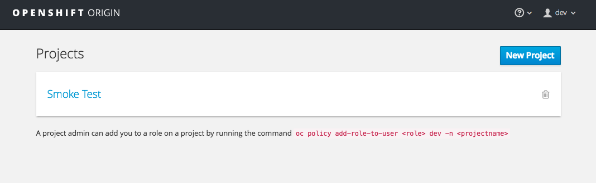
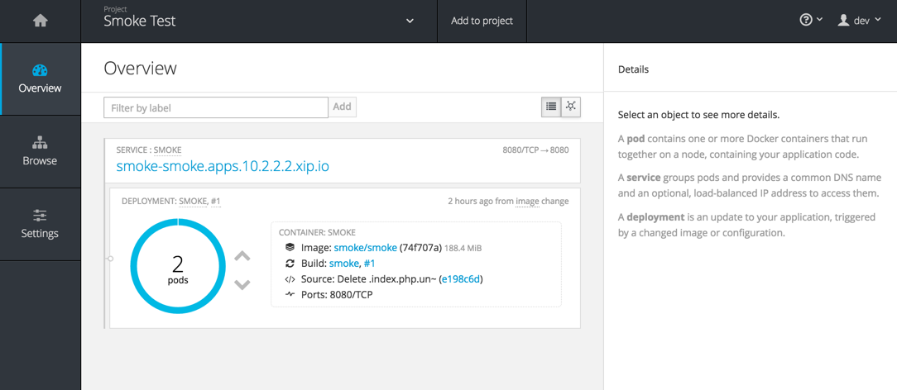

#** Lab 2: Smoke Test and Quick Tour **

###** Command Line **

The first thing we want to do to ensure that our `oc` command line tools was
installed and successfully added to our path is login to the OpenShift
environment that has been provided for this Roadshow session.  In
order to login, we will use the `oc` command and then specify the server that we
want to authenticate to.  Issue the following command:

````
$ oc login 10.2.2.2:8443
````

**Note:** After entering in the above command, you may be prompted to accept the
security certificate

You may see the following output:

````
	The server uses a certificate signed by an unknown authority.
	You can bypass the certificate check, but any data you send to the server could be intercepted by others.
	Use insecure connections? (y/n):
````

Enter in *Y* to use a potentially insecure connection.  The reason you received
this message is because we are using a self-signed certificate for this
workshop, but we did not provide you with the CA certificate that was generated
by OpenShift. In a real-world scenario, either OpenShift's certificate would be
signed by a standard CA (eg: Thawte, Verisign, StartSSL, etc.) or signed by a
corporate-standard CA that you already have installed on your system.

**Note:** On some versions of Microsoft Windows, you may get an error that the
server has an invalid x.509 certificate.  If you receive this error, enter in
the following command:

````
	$ oc login 10.2.2.2:8443 --insecure-skip-tls-verify=true
````

Once you issue the `oc login` command, you will be prompted for the username and
password combination for your user account:

````
    Username: dev
    Password: dev
````

Once you have authenticated to the OpenShift server, you will see the
following confirmation message:

````
    Login successful.

    Using project "smoke".    
````

Congratulations, you are now authenticated to the OpenShift server. The
OpenShift master includes a built-in OAuth server. Developers and administrators
obtain OAuth access tokens to authenticate themselves to the API. By default
your authorization token will last for 24 hours. There is more information about
the login command and its configuration in the [OpenShift 
Documentation](https://docs.openshift.org/latest/cli_reference/get_started_cli.html#basic-setup-and-login).


###**Using a project**

Projects are a top level concept to help you organize your deployments. An
OpenShift project allows a community of users (or a user) to organize and manage
their content in isolation from other communities. Each project has its own
resources, policies (who can or cannot perform actions), and constraints (quotas
and limits on resources, etc). Projects act as a "wrapper" around all the
application services and endpoints you (or your teams) are using for your work.
For this first lab, we are going to use a project named *smoke* that has been
created and populated with an application for you.

During this lab, we are going to use a few different commands to make sure that
things in the environment are working as expected.  Don't worry if you don't
understand all of the terminology as we will cover it in detail in later labs.

The first thing we want to do is switch to the *smoke* project. You
can do this with the following command:

````
	$ oc project smoke
````

You will see the following confirmation message:

````
	Now using project "smoke" on server "https://10.2.2.2:8443".
````

The next thing we want to check is the routes associated with this project. A
simple explanation for how routes work is:

1. A request comes in to an OpenShift node on port 80 (HTTP) or 443 (HTTPS)
1. A Docker container running the router is bound to those ports, and receives the request
1. The router looks at the HTTP header for the host entry and matches it with a defined route
1. The router proxies the request on to a service endpoint that corresponds to that defined route

In order to view the routes for your *smoke* project, enter in the following command:

````
	$ oc get routes
````

You should see output similar to the following:

````
    NAME      HOST/PORT                                                    PATH      SERVICE   LABELS      INSECURE POLICY   TLS TERMINATION
    smoke     smoke-smoke.10.2.2.2.xip.io           smoke     app=smoke      
````

###**The Web Console**

OpenShift ships with a web-based console that will allow users to
perform various tasks via a browser.  To get a feel for how the web console
works, open your browser and go to the following URL:

````
	https://10.2.2.2:8443
````

The first screen you will see is the authentication screen.  Enter in the following credentials:

````
	Username: dev
	Password: dev
````


After you have authenticated to the web console, you will be presented with a
list of projects that your user has permission to work with. You will see
something that looks like the following image:



Click on the *smoke* project. When you click on the *smoke*
project, you will be taken to the project overview page which will list all of
the routes, services, deployments, and pods that you have running as part of
your project.  For this example, you will see a frontend that is deployed to
two pods.



Once you have digested the information on the overview page, mouseover *Browse*
tab on the left hand side of the screen, and explore the different menus. Play
around a bit more with the web console to get familiar with the various tabs and
options.  However, we will be using a mix of command line tooling and the web
console for the labs.


**[End of Lab 2](/)**
